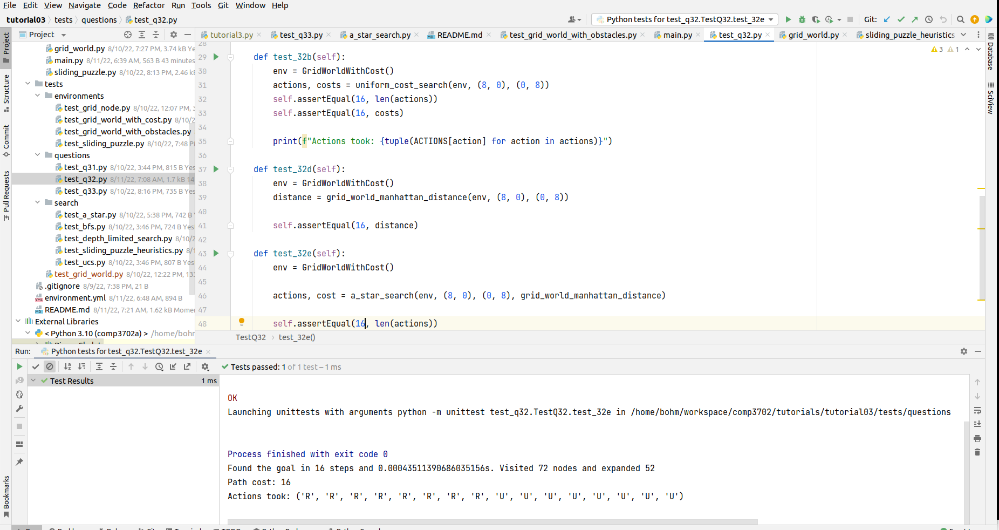

# Tutorial Week 3 (A* Search)

Loosely based on official solutions that will be released later in the week.

The main differences to the other solutions:

1) It uses agent taking actions/steps in environment paradigm
2) Hides the Node implementation from the end user
3) Keeps the state as immutable tuple of tuples rather than lists
4) Fixes naming conventions and caches some calculations to make the code more readable
5) __There are unit tests__ - for everything

### Dependencies
I used Python 3.10 (because of the match/case - but I removed it later), but it should work with any 3.x.
There are no extra dependencies, but just in case there will be, there is [environment.yml](environment.yml).

To create/restore the environment:

    conda env create -f environment.yml

To update the file:

    conda env export > environment.yml

### Running
[main.py](main.py) can be used for experimentation testing different initial/goal combinations.

    python main.py

However, the intended access is through the unit tests.

### Running Tests
The tests are in [tests/](tests/) dir, split into
sub-dirs for tests related to environments, search and tutorial sheet questions where each question has its own test case. 

These can be run either individually or everything (for questions dir):

    python -m unittest discover -s tests/questions -t tests/questions

The easiest is probably using the IDE such as PyCharm (I am using professional version, but there is a community version as well):

